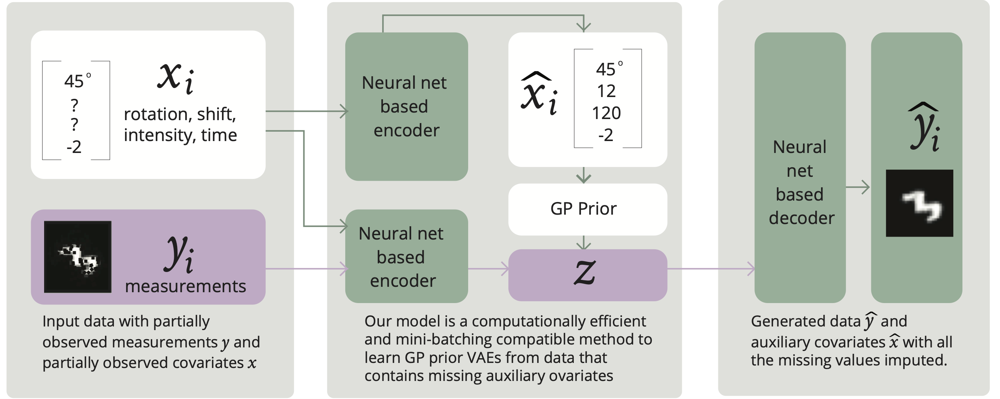

Learning Conditional Variational Autoencoders with Missing Covariates
===========================================================================================
This repository contains the python scripts used in our [paper](https://doi.org/10.1016/j.patcog.2023.110113) published in the journal, [Pattern Recognition](https://www.sciencedirect.com/journal/pattern-recognition).

Overview
--------
In this work, we propose a method to learn conditional VAEs from datasets in which auxiliary covariates can contain missing values as well. The proposed method augments the conditional VAEs with a prior distribution for the missing covariates and estimates their posterior using amortised variational inference. At training time, our method accounts for the uncertainty associated with the missing covariates while simultaneously maximising the evidence lower bound. We develop computationally efficient methods to learn CVAEs and GP prior VAEs that are compatible with mini-batching.<br/><br/><br/>

<br/><br/>
The figure shows a modfied version of the MNIST dataset as an example and provides an overview of our method, applied to a GP prior VAE model. Our model can perform the imputation of missing values in the data instances as well as auxiliary covariates. See the manuscript for more details.

Prerequisites
---------------
These scripts require the following software:
- Python (>= 3.6.0)
- [PyTorch](https://pytorch.org) (>= 1.7) and associated dependencies.
- [GPyTorch](https://gpytorch.ai) (>= 1.3)

Downloading MNIST digits
------------------------
- Download and unzip archive from here: https://www.dropbox.com/s/j80vfwcqqu3vmnf/trainingSet.tar?dl=0


Using our method
----------------
- Create results folder.

- To run the **model**:
		`python main.py --f=./config/config_template.txt`

Longitudinal Variational Autoencoder
------------------------------------
See our previous work [Ramchandran et al., 2021b](http://proceedings.mlr.press/v130/ramchandran21b.html) for an overview of the L-VAE model.

Cite
---------------
Please cite this work as:
```
Ramchandran, S., Tikhonov, G., Lönnroth, O., Tiikkainen, P., & Lähdesmäki, H. (2023), Learning conditional variational autoencoders with missing covariates, Pattern Recognition, https://doi.org/10.1016/j.patcog.2023.110113.
```

Authors
---------------
- [Siddharth Ramchandran](https://fi.linkedin.com/in/sidrama)
- [Gleb Tikhonov](https://www.researchgate.net/profile/Gleb_Tikhonov)
- [Otto Lönnroth](https://fi.linkedin.com/in/otto-lönnroth-34a28b285)
- [Pekka Tiikkainen](https://fi.linkedin.com/in/pekka-tiikkainen-b2b5745)
- [Harri Lähdesmäki](http://users.ics.aalto.fi/harrila/)

License
---------------
This project is licensed under the MIT License - see the [LICENSE](LICENSE) file for details.
